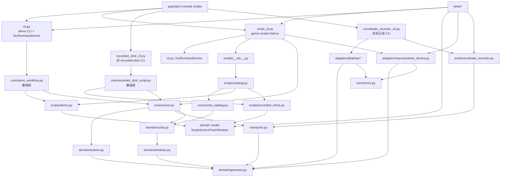

# 项目结构分析

目标不是画理想架构，而是记录当前真实结构，帮助控制项目复杂度。

## 文件和模块职责

### `src/game_automation/domain/`

- `geometry.py`：定义 `Point` / `Rect` 基础值对象。
- `actions.py`：定义 `Click` / `Drag` / `Wait` 动作模型。
- `windows.py`：定义 `ScreenWindow` / `AreaWindow`，负责窗口内坐标到屏幕坐标的解析。
- `script.py`：定义 `Script(name, window, actions)` 聚合模型。
- `__init__.py`：聚合导出纯领域数据模型。

### `src/game_automation/core/`

- `ports.py`：定义核心依赖的协议：输入设备、鼠标位置读取、按键读取。
- `runner.py`：把 `Script` 动作翻译成 `InputDevice` 调用。
- `script_catalog.py`：按名称管理脚本集合。
- `demo_workflow.py`：旧 demo 兼容入口，实际委托 `scripts.demo`。
- `recorded_click_script.py`：旧 recorded-click 兼容入口，实际委托 `scripts.recorded_clicks`。
- `errors.py`：adapter 相关错误。
- `__init__.py`：核心 API 聚合导出。

### `src/game_automation/scripts/`

- `demo.py`：内置 `demo` 脚本定义。
- `recorded_clicks.py`：内置 `recorded-clicks` 脚本定义。
- `catalog.py`：组装 `DEFAULT_SCRIPT_CATALOG`。
- `__init__.py`：导出默认 catalog 和脚本构造函数。

### `src/game_automation/adapters/`

- `macos/pointer_device.py`：macOS `pyautogui` 鼠标执行 adapter。
- `desktop/pointer_position.py`：读取当前鼠标坐标的 adapter。
- `desktop/terminal_keyboard.py`：读取终端按键的 adapter。
- 各级 `__init__.py`：聚合导出。

### `src/game_automation/tools/`

- `coordinate_recorder.py`：坐标记录核心循环，不直接依赖平台。
- `__init__.py`：空包入口。

### 顶层 CLI

- `script_cli.py`：推荐入口，`game-scripts list/run`。
- `cli.py`：demo CLI，同时放了 `DryRunInputDevice` / `RecordedOperation`。
- `recorded_click_cli.py`：旧 recorded-click CLI。
- `coordinate_recorder_cli.py`：坐标记录工具 CLI。
- `__init__.py`：包标识。

### Tests

- `test_script_model.py`、`test_runner.py`、`test_windows.py`：核心领域测试。
- `test_script_catalog.py`、`test_script_cli.py`：命名脚本管理和 CLI。
- `test_demo_workflow.py`、`test_recorded_click_script.py`、`test_recorded_click_cli.py`：兼容入口。
- `test_macos_adapter.py`、`test_coordinate_recorder_adapters.py`：adapter。
- `test_coordinate_recorder.py`：工具核心循环。
- `support/fake_device.py`：测试 fake input device。

### OpenSpec

- `openspec/specs/*`：当前主规格。
- `openspec/changes/archive/*`：已完成变更记录，不参与运行时。

## 模块依赖关系

主要依赖方向：

- CLI -> core / scripts / adapters / domain
- scripts -> domain model
- core runner -> core ports
- adapters -> domain value objects / core errors
- tools -> core ports / domain value objects
- tests -> 所有层

一个明显反向点：`core/demo_workflow.py` 和 `core/recorded_click_script.py` 反过来依赖 `scripts/*`。这是为了兼容旧 API，但会让 `core` 不再完全纯净。

## 核心领域

真正核心是：

- `Point`、`Rect`
- `Click`、`Drag`、`Wait`
- `ScreenWindow`、`AreaWindow`
- `Script`
- `ScriptRunner`
- `InputDevice` / `PointerPositionReader` / `KeyStateReader`

这些模型现在已经集中到 `src/game_automation/domain/`。`ScriptCatalog` 更像“应用层/管理边界”，可以暂时放 core，但它不是动作执行领域本身。

## Adapter

明确 adapter：

- `MacOSPointerDevice`
- `PyAutoGuiPointerPositionReader`
- `TerminalKeyStateReader`

CLI 不是 adapter，更像 entrypoint/composition root：负责组装 adapter、catalog、runner。

## 职责混乱点

- `cli.py`：既是 demo CLI，又承载通用 dry-run 类型，被 `script_cli.py` 复用。这个文件已经变成“demo + 测试/模拟设备共享模块”。
- `core/demo_workflow.py`、`core/recorded_click_script.py`：名字在 core，但职责是兼容旧入口，并依赖 `scripts`。这会削弱 core 边界。
- `recorded_click_cli.py`：和 `script_cli.py run recorded-clicks` 功能重复。
- `scripts/__init__.py`：导入 catalog 会顺带加载全部脚本定义；现在问题不大，但脚本变多后会变重。
- `openspec/specs/script-management/spec.md`：Purpose 还是归档生成的 TBD，文档质量比代码低一档。

## 当前最可能的复杂度来源

1. 入口太多：`game-automation-demo`、`game-recorded-clicks`、`game-scripts`、`game-coordinate-recorder`。
2. 兼容层开始堆积：新结构已经有 `scripts/catalog`，但旧 workflow/CLI 还保留。
3. dry-run 逻辑位置不稳定：目前借住在 `cli.py`。
4. core 聚合导出仍偏宽：`core/__init__.py` 导出 workflow、catalog、errors 和 ports，调用方便但边界仍需要继续收窄。
5. 脚本定义是 Python 代码，短期简单，长期会让“编辑脚本”和“改程序”混在一起。
6. macOS 默认真实执行，使用顺手，但风险也更高，测试需要 fake adapter 绕开副作用。

## 可以收缩的结构

优先级建议：

1. 收缩旧入口：保留 `game-scripts`，逐步弱化 `game-recorded-clicks` 和 `game-automation-demo`。README 只主推一个入口。
2. 抽出 dry-run：把 `DryRunInputDevice` / `RecordedOperation` 从 `cli.py` 移到类似 `adapters/dry_run.py` 或 `testing/dry_run.py`。
3. 清理 core 反向依赖：让 `core/demo_workflow.py`、`core/recorded_click_script.py` 要么删除，要么移到 `scripts/compat.py`。
4. 继续限制 `core/__init__.py`：只导出运行核心和端口。workflow、catalog、兼容函数可以从原模块 import。
5. 简化 scripts 包：`scripts/__init__.py` 不必导出所有脚本对象，只导出 `DEFAULT_SCRIPT_CATALOG`。
6. 修 OpenSpec 小债：把 `script-management` 的 `Purpose` 从 TBD 改掉。

## 当前真实结构图

## 判断

项目现在还不大，真正危险的不是 core 复杂，而是“为了方便使用新增入口和兼容层”正在把边界拉厚。下一步控制复杂度，重点不是继续拆 core，而是减少入口数量、把 dry-run 放正、让 core 不再依赖 scripts。
