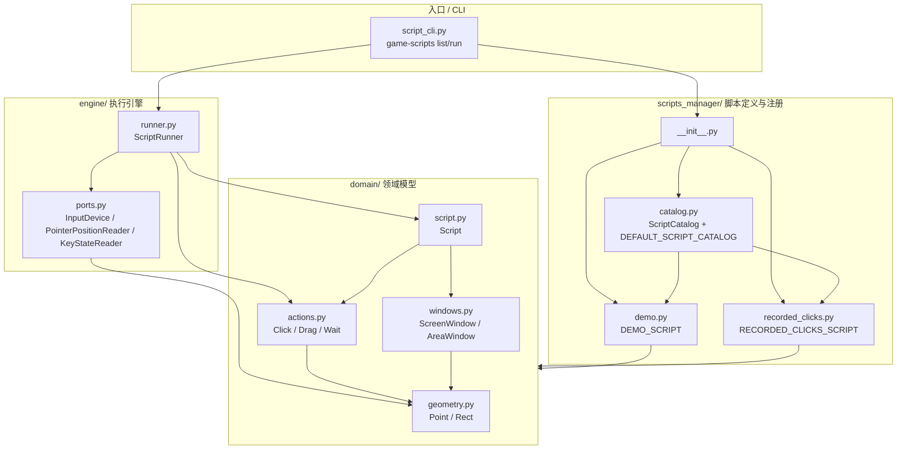

# 项目结构分析

目标不是画理想架构，而是记录当前真实结构，帮助控制项目复杂度。

## 文件和模块职责

### `src/game_automation/domain/` — 纯领域数据模型

- `geometry.py`：定义 `Point` / `Rect` 基础值对象。
- `actions.py`：定义 `Click` / `Drag` / `Wait` 动作模型。
- `windows.py`：定义 `ScreenWindow` / `AreaWindow`，负责窗口内坐标到屏幕坐标的解析。
- `script.py`：定义 `Script(name, window, actions)` 聚合模型。
- `__init__.py`：聚合导出纯领域数据模型。

### `src/game_automation/engine/` — 脚本执行引擎

- `ports.py`：定义引擎依赖的端口协议：`InputDevice`、`PointerPositionReader`、`KeyStateReader`。
- `runner.py`：`ScriptRunner`，把 `Script` 动作逐条翻译为 `InputDevice` 调用。
- `__init__.py`：包标识。

### `src/game_automation/scripts_manager/` — 脚本定义与注册管理

- `demo.py`：内置 `demo` 脚本定义。
- `recorded_clicks.py`：内置 `recorded-clicks` 脚本定义。
- `catalog.py`：`ScriptCatalog` 类 + `DEFAULT_SCRIPT_CATALOG` 默认装配。
- `__init__.py`：导出默认 catalog 和脚本构造函数。

### `src/game_automation/adapters/` — 平台适配与模拟（实现 engine.ports 中的端口）

- `macos/pointer_device.py`：`MacOSPointerDevice` → 实现 `InputDevice`，通过 pyautogui 驱动 macOS 鼠标。
- `desktop/pointer_position.py`：`PyAutoGuiPointerPositionReader` → 实现 `PointerPositionReader`。
- `desktop/terminal_keyboard.py`：`TerminalKeyStateReader` → 实现 `KeyStateReader`。
- `dry_run.py`：`DryRunInputDevice` → 实现 `InputDevice`，只记录不执行。
- `__init__.py`：聚合导出，docstring 列出所有端口实现关系。

### `src/game_automation/tools/` — 独立工具

- `coordinate_recorder.py`：坐标记录核心循环，不直接依赖平台。
- `__init__.py`：包标识。

### 顶层 CLI

- `script_cli.py`：统一入口，`game-scripts list/run`。
- `coordinate_recorder_cli.py`：坐标记录工具 CLI。
- `__init__.py`：包标识。

### Tests

- `test_script_model.py`、`test_runner.py`、`test_windows.py`：核心领域测试。
- `test_script_catalog.py`、`test_script_cli.py`：命名脚本管理和 CLI。
- `test_macos_adapter.py`、`test_coordinate_recorder_adapters.py`：adapter。
- `test_coordinate_recorder.py`：工具核心循环。
- `support/fake_device.py`：测试 fake input device。

## 模块依赖关系

主要依赖方向：

- CLI → scripts_manager / engine / adapters / domain
- scripts_manager → domain model
- engine/runner → engine/ports → domain geometry
- adapters → engine/ports / domain geometry
- tools → engine/ports / domain geometry
- tests → 所有层

## 核心领域

真正核心是：

- `Point`、`Rect`
- `Click`、`Drag`、`Wait`
- `ScreenWindow`、`AreaWindow`
- `Script`
- `ScriptRunner`
- `InputDevice` / `PointerPositionReader` / `KeyStateReader`

领域模型集中在 `domain/`，执行引擎在 `engine/`，脚本注册管理在 `scripts_manager/catalog.py`。

## Adapter → Ports 实现关系

所有 adapter 都是 `engine/ports.py` 中端口协议的具体实现：

| Adapter | 实现端口 |
|---------|---------|
| `MacOSPointerDevice` | `InputDevice` |
| `DryRunInputDevice` | `InputDevice` |
| `PyAutoGuiPointerPositionReader` | `PointerPositionReader` |
| `TerminalKeyStateReader` | `KeyStateReader` |

`engine/ports.py` 只定义接口（Protocol），不依赖任何 adapter。adapter 反向依赖 ports 和 domain，符合依赖倒置。

CLI 不是 adapter，是 entrypoint/composition root：负责组装 adapter、catalog、runner。

## 职责混乱点

- `scripts_manager/__init__.py`：导入 catalog 会顺带加载全部脚本定义；现在问题不大，但脚本变多后会变重。
- `openspec/specs/script-management/spec.md`：Purpose 还是归档生成的 TBD，文档质量比代码低一档。

## 当前最可能的复杂度来源

1. 入口目前只有 2 个：`game-scripts`、`game-coordinate-recorder`，暂时合理。
2. 脚本定义是 Python 代码，短期简单，长期会让"编辑脚本"和"改程序"混在一起。
3. macOS 默认真实执行，使用顺手，但风险也更高，测试需要 fake adapter 绕开副作用。
4. `scripts_manager/__init__.py` 导入 catalog 会顺带加载全部脚本定义，脚本变多后会变重。

## 当前真实结构图



**依赖方向：**

```
CLI ──→ scripts_manager ──→ domain
  │                           ▲
  └──→ engine ────────────────┘
```

CLI 是组装点：把 scripts_manager 里的脚本交给 engine 执行。domain 是纯数据，被 scripts_manager 和 engine 共同依赖。adapters 和 tools 是外围模块，实现 engine.ports 的端口协议后注入 CLI。

## 判断

`core/` 已拆分为语义清晰的三个归属：

- **engine/**：脚本执行引擎（ports + runner），ports 定义引擎需要的端口协议
- **adapters/**：实现 engine.ports 的所有端口协议（平台实现 + 模拟设备 + 异常）
- **scripts_manager/**：脚本定义 + ScriptCatalog 类 + 默认装配合一

每个包名直接表达职责，不再有模糊的"core"概念。adapters 与 engine.ports 的实现关系通过 docstring 和架构图虚线清晰表达。当前架构的依赖方向统一（自上而下），无反向依赖。

下一步关注：scripts_manager 包随脚本增多如何加载，以及是否引入脚本文件格式（JSON/YAML）让脚本编辑和程序代码分离。
